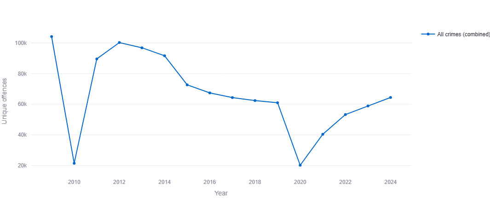
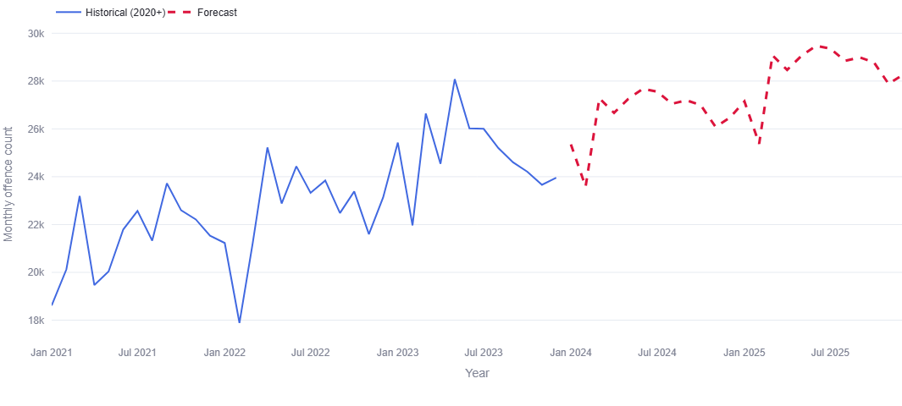
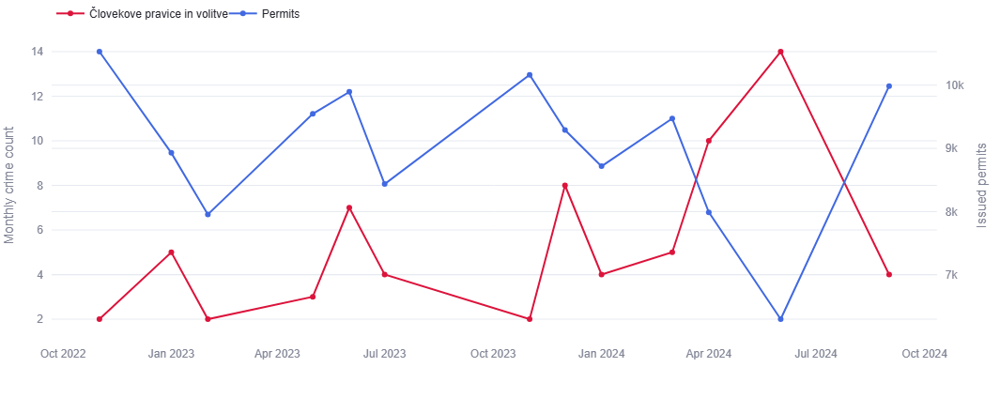

# Kriminal v Sloveniji: Analiza podatkov za leto 2024

## Uvod

Kriminal je eden izmed ključnih kazalnikov zdravja družbe. Razumevanje njegovih vzorcev — kje se pojavlja, kdo so storilci, kdaj se dogaja in kakšne so posledice — je temelj za učinkovito preventivo in načrtovanje policijskega dela. V tej analizi smo pregledali podatke Policije Republike Slovenije vse do leta 2024, ki obsegajo okoli 110.000 vrstic za vsako leto in 65.000 unikatnih kaznivih dejanj v osmih policijskih upravah ter 60 upravnih enotah po vsej državi. S pomočjo teh podatkov smo izdelali aplikacijo v okolju Streamlit, ki ponazarja rezultate analize (npr. trende, vpliv vremena in imigracij ter trajanje pregona).

Cilj analize je bil odgovoriti na vprašanja o geografski porazdelitvi kriminala, vlogi državljanstva storilcev, časovnih vzorcih in resnosti kaznivih dejanj ter s tem ponuditi vpogled, ki bi lahko koristil pri bolj učinkovitem razporejanju policijskih patrulj in oblikovanju preventivnih programov.

---

## Trendi kriminala čez leta

Število kriminalnih dejanj je pred letom 2020 padalo,v letu 2020 je bila najnižja stopnja kriminala, nato pa je začelo spet nekoliko naraščati. Najnižja stopnja kriminala je bila v letu 2020, kar je bilo pričakovano zaradi karantene. Vrste kriminala, ki so v zadnjih letih zelo narasle so kazniva dejanja v prometu in kibernetska kazniva dejanja.

**Po mesecih** se največ kriminala zgodi marca, maja in decembra, najmanj pa februarja.

**Po dnevih v tednu** so med tednom kriminalna dejanja približno enakomerno porazdeljena, nekoliko narastejo le ob petkih in ponedeljkih. V soboto in nedeljo pa število drastično upade.

**Po urah** je daleč največ kriminala med 22. in 1. uro zjutraj, nato pa pade in je med 1. in 5. uro najnižja stopnja kriminala.

---

## Napovedi količine kriminala v prihodnosti

S pomočjo Holt-Wintersovega eksponentnega glajenja smo izdelali napovednik števila kriminala v naslednjih nekaj mesecih. Izberemo lahko, od katerega leta naprej učimo naš model ter za koliko mesecev naprej bo napovedal število. 

Z izbranim začetnim učnim letom 2020 in napovedjo za 24 mesecev dobimo graf ki nam kaže, da se bo kriminal zviševal.

---

## Geografska analiza

Največ kriminala v Sloveniji se zgodi v Ljubljani, tako v absolutnih številkah kot tudi pri normalizaciji na 100 prebivalcev posamezne regije. Pri normaliziranih vrednostih ji sledita Novo mesto in Koper, po absolutnem številu pa Celje in Novo mesto. Najmanj kriminala je v obeh primerih v Novi Gorici in Murski Soboti.

V vseh regijah je največ premoženjskih kaznivih dejanj, sledi pa nasilje nad osebami, ki največji delež predstavlja v PU Murska Sobota, s kar 27,8 %.

---

## Vpliv števila imigrantov na kriminal

S pomočjo Pearsonovega koeficienta korelacije smo izračunali, kakšna je korelacija med številom vrste kriminala in številom izdanih dovoljenj za prebivanje tujcem. Število izdanih dovoljenj se med leti ni drastično spremenilo.

Največjo negativno korelacijo ima vpliv imigrantov na človekove pravice in volitve(67%), največjo pozitivno pa na zlorabo uradnega položaja in oviranje pravosodja(0.32).

---

## Vpliv vremena na kriminal

S pomočjo korelacijskega koeficienta smo izračunali tudi vpliv temperature in količine padavin na količino kriminala. Model za nobenega od teh primerov v letu 2024 ne najde jasne korelacije.

## Čas kazenskega pregona

Izračunali smo tudi, koliko časa traja postopek od vložitve obtožnice do končne sodbe. Večina primerov se zaključi hitro, vzame manj kot eno leto, povprečno pa traja 0.3 leta. 16 tisoč primerov je trajalo eno leto, obstaja pa tudi primer, ki je do zaključka sodbe potreboval kar 19 let.

---

## Verjetnost kriminalnega dogodka

Ustvarili smo program, ki pri določenem scenariju napove, kako verjeten je kriminal in katera vrsta se bo najverjetneje zgodila. Model za leto 2024 ima 64.6% natančnost.

Nastavimo lahko uro, dan v tednu, policijsko upravo in število izdanih dovoljenj za bivanje tujcem. Tako nam model za petek ob 23. uri v Ljubljani napove, da je verjetnost kriminala 51.3%, najverjetneje pa se bodo zgodila premoženjska kazniva dejanja.

---

## Sklepne ugotovitve

Analiza podatkov Policije Republike Slovenije za obdobje do leta 2024 je razkrila več pomembnih vzorcev slovenskega kriminala.

**Splošni trendi** kažejo, da je kriminaliteta dosegla najnižjo točko leta 2020, kar je neposredna posledica pandemičnih omejitev, nato pa se je trend obrnil navzgor. Med najhitreje rastočimi kategorijami izstopata prometna in kibernetska kriminaliteta, ki odražata spreminjajoče se vedenjske in tehnološke vzorce v sodobni družbi.

**Geografsko Ljubljana** izstopa tako po absolutnem številu kot po normalizirani stopnji kriminalitete na prebivalca, sledita ji Novo Mesto in Koper. Nasprotno, Murska Sobota in Nova Gorica beležita najnižje vrednosti. V vseh regijah prevladuje premoženjska kriminaliteta, medtem ko je nasilje nad osebami posebej izrazito v PU Murska Sobota.

**Časovni vzorci** kažejo, da se največ kaznivih dejanj zgodi med 22. in 1. uro ponoči, kar nakazuje, da nočne ure predstavljajo največje tveganje. Med tednom je kriminaliteta sorazmerno enakomerna, z rahlo povišanjem ob petkih in ponedeljkih, ob vikendih pa opazno upade.

**Demografski vplivi** so bili preverjeni z analizo korelacije med imigracijo in kriminaliteto. Rezultati ne kažejo statistično pomembne splošne zveze, posamezne korelacije pa so bodisi šibke bodisi negativne, kar ne potrjuje pogosto prisotnih predsodkov o povezavi med imigranti in kriminaliteto.

**Napovedni modeli** z metodo Holt-Winters nakazujejo zmeren porast kriminalitete v prihodnih mesecih. Klasifikacijski model za napoved verjetnosti in vrste kaznivega dejanja pri danih okoliščinah dosega 64,6 % natančnost, kar predstavlja dober izhodiščni temelj za nadaljnji razvoj.

**Kazenski pregon** je v povprečju hiter (0,3 leta), čeprav posamezni primeri razkrivajo sistemske zamude, ki trajajo tudi do 19 let.

Na osnovi ugotovitev bi bila smiselna okrepitev policijske prisotnosti v večernih in nočnih urah, ciljano usmerjanje virov v regije z visoko normalizirano stopnjo kriminalitete ter razvoj specializiranih programov za preprečevanje prometne in kibernetske kriminalitete, ki sta področji z izrazito rastočim trendom.
