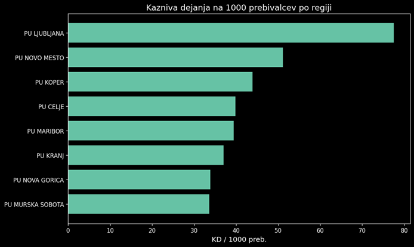
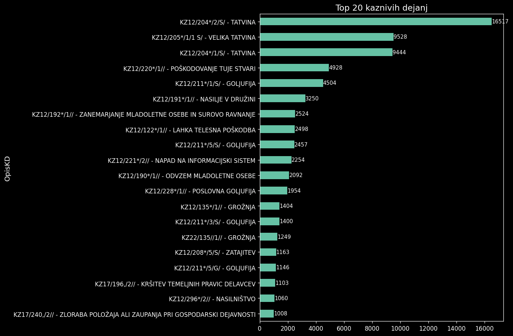

# Kriminal v Sloveniji: Analiza podatkov za leto 2024

## Uvod

Kriminal je eden izmed ključnih kazalnikov zdravja neke družbe. Razumevanje njegovih vzorcev — kje se pojavlja, kdo so storilci, kdaj se dogaja in kakšne so posledice — je temelj za učinkovito preventivo in načrtovanje policijskega dela. V tej analizi smo pregledali podatke Policije Republike Slovenije za leto 2024, ki obsegajo **110.452 vrstic** in **65.297 unikatnih kaznivih dejanj** v osmih policijskih upravah ter 60 upravnih enotah po vsej državi.

Cilj analize je bil odgovoriti na vprašanja o geografski porazdelitvi kriminala, vlogi državljanstva storilcev, časovnih vzorcih in resnosti kaznivih dejanj ter s tem ponuditi vpogled, ki bi lahko koristil pri bolj učinkovitem razporejanju policijskih patrulj in oblikovanju preventivnih programov.

---

## Geografska porazdelitev: Ljubljana na samem vrhu:(

Eden izmed najbolj udarnih rezultatov analize je izrazita geografska koncentracija kriminala. Z variančno metodo (μ + 2σ) smo ugotovili, da je **Ljubljana edina upravna enota, ki statistično izstopa** s kar **35.174 kaznivimi dejanji** — daleč nad izračunanim pragom 10.984. Nobena druga upravna enota se niti ni približala tej meji.

To ni presenetljivo že na prvi pogled, saj je Ljubljana največje mesto v Sloveniji in gospodarsko ter prometno središče države. Vendar pa absolutno število ne pove celotne zgodbe. Ko kazniva dejanja normaliziramo glede na število prebivalcev (KD na 1000 prebivalcev), slika postane še zanimivejša: gostota kriminala v Ljubljani ostaja visoka, kar kaže, da ni zgolj posledica velikega števila ljudi, ampak tudi specifičnih urbanih dejavnikov — večje anonimnosti, intenzivnega nočnega življenja, večjega pretoka turistov in tujcev ter večje koncentracije premoženja.

Med top 15 upravnimi enotami po absolutnem številu kaznivih dejanj izstopajo tudi Maribor, Celje, Koper in Novo mesto. Slednje je posebej zanimivo z vidika demografske strukture populacije — Novo mesto in okolica imata nadpovprečno prisotnost romske skupnosti, ki je pogosto v kontekstu kriminalistike posebej omenjana. Analiza podatkov kaže, da nekatere manjše urbane enote v jugovzhodni Sloveniji beležijo višjo stopnjo kriminala glede na populacijo.

---

## Državljanstvo storilcev: Tujci in kriminal

Eno izmed ključnih vprašanj naše analize je bilo: ali obstajajo razlike v pogostosti kaznivih dejanj glede na državljanstvo storilca? Podatki kažejo, da so osebe s **tujim državljanstvom** nadpovprečno zastopane med storilci v Ljubljanski in Koprski policijski upravi — torej v območjih z največjim pretokom migrantov, turistov in sezonskih delavcev.

Gruče, ki smo jih identificirali z metodo K-Means, jasno ločijo Ljubljano od preostalih 59 upravnih enot. Profil gruče 0 (Ljubljana) kaže **delež tujcev med udeleženci 16,1 %**, medtem ko je v gruči 1 (preostale enote) ta delež nižji pri **12,1 %**. To je statistično in praktično pomembna razlika, ki kaže, da je Ljubljana ne le absolutni, ampak tudi relativni vrh glede na vpletenost tujcev v kazniva dejanja.

To seveda ne pomeni nujno, da so tujci "bolj kriminalni" — pomeni, da v mestih z večjim deležem tujcev v populaciji (Ljubljana, Koper, turistična območja) tujci tudi pogosteje nastopajo v policijskih evidencah, bodisi kot storilci bodisi kot žrtve. Podatki o vrsti osebe (žrtev/osumljenec) kažejo, da tujci niso izključno storilci — pogosto nastopajo tudi kot žrtve, zlasti pri premoženjskih kaznivih dejanjih.

---

## Časovni vzorci: Kdaj se kriminal zgodi?

Analiza časovne porazdelitve razkriva jasne vzorce, ki so praktično koristni za načrtovanje policijskega dela.

**Po mesecih** je kriminal relativno enakomerno porazdeljen skozi leto, z blagim porastom v poletnih mesecih (junij–avgust), kar je verjetno povezano z večjim številom turistov, nočnim življenjem in priložnostnimi tatvininami.

**Po dnevih v tednu** so petek, sobota in nedelja dnevi z nekoliko višjo stopnjo kriminala, kar sovpada z intenzivnejšim socialnim življenjem in večjo porabo alkohola ob koncu tedna.

**Po urah** pa je slika dramatična: **14,7 % vseh kaznivih dejanj** je evidentiranih v intervalu med polnočjo in 1. uro zjutraj — kar je daleč največ od vseh urnih intervalov. Drugi izrazit vrh je med 23. in 24. uro (9,0 %). V dnevnih urah je kriminal enakomerno razporejen z vrhovimi med 15. in 18. uro. Ta vzorec jasno kaže, da je nočni čas — zlasti prehod med soboto in nedeljo — kritično obdobje, ki zahteva okrepljene policijske patrulje.

---

## Vrsta kaznivih dejanj in materialna škoda

Med vrstami kaznivih dejanj prevladujejo **premoženjska kazniva dejanja**, kar je skladno s trendi v večini evropskih držav. Med top 20 kaznivih dejanj so najpogostejše tatvine, goljufije in kazniva dejanja zoper premoženje.

Analiza materialne škode kaže močno asimetrično porazdelitev: **mediana škode znaša le 100 EUR**, kar pomeni, da je večina kaznivih dejanj premoženjske narave razmeroma nizke vrednosti. Kljub temu obstaja dolg rep visokovrednih kaznivih dejanj — Z-score metoda je identificirala **416 statističnih osamelcev**, kjer škoda presega prag 3 standardne deviacije nad povprečjem (na logaritemski skali), IQR metoda pa je zaznala kar **3.155 primerov** nad zgornjo mejo 2.350 EUR. Med temi izstopajo primeri poslovne goljufije, zlorabe položaja in overitve lažne vsebine s škodami do **500.000 EUR** in več.

KS test je potrdil, da porazdelitev materialne škode ni normalna niti na logaritemski skali (p ≈ 0), torej se močno razlikujejo od večinskih manjših  do nekaterih izredno velikih škod.

---

## Demografski profil storilcev in žrtev

Starostna analiza pokaže, da so najpogostejši storilci v starostnem razredu **24–44 let**, torej aktivna delovna populacija. Med žrtvami je porazdelitev bolj enakomerna, a z opaznim deležem najranljivejših skupin — otrok in starejših.

Po spolu so moški statistično bistveno bolj zastopani tako med storilci kot med žrtvami, kar je skladno z globalnimi trendi kriminalistike.

Kar se tiče vpliva substanc, podatki kažejo, da je **vpliv alkohola evidentiran v razmeroma majhnem deležu primerov** — kar je nekoliko presenetljivo, a gre deloma pripisati dejstvu, da je ta podatek pogosto neznan ali ni evidentiran (visok delež vrednosti "NN"). Vpliv mamil je še redkeje zabeležen (tu je vredno omeniti, da je kar veliko podatkov nasplosno bilo "NN", kar kaže na nenajboljše beleženje).

---

## Gručenje in profili upravnih enot

Z metodo K-Means (optimalno K=2) in aglomerativnim gručenjem (Ward metoda) smo identificirali **dva jasno ločena profila** upravnih enot v Sloveniji. Obe metodi sta dali identične rezultate (Adjusted Rand Index = 1,0), kar kaže na robustnost ugotovitev.

**Gruča 0 — Ljubljana:** absolutni statistični osamelec z več kot 21.000 unikatnimi KD, visokim številom udeleženih oseb (35.063) in nadpovprečnim deležem tujcev. Ljubljana se od vseh ostalih enot loči tako po obsegu kot po profilu kriminala.

**Gruča 1 — preostale enote:** 59 upravnih enot s povprečno 735 KD na enoto, nižjim deležem tujcev in nekoliko višjim deležem kaznivih dejanj pod vplivom alkohola in mamil — kar nakazuje, da je v manjših, bolj ruralnih okoljih "klasičen" kriminal (nasilje, prekrški pod vplivom substanc) relativno pogostejši kot v urbanih centrih.

PCA projekcija na dve komponenti pojasni 45,9 % variance (PC1: 25,5 %, PC2: 20,4 %), kar kaže, da je kriminalitetni profil upravnih enot relativno kompleksen in ga ni mogoče zvesti le na en ali dva dejavnika.

---

## Sklepne ugotovitve

Analiza kriminala v Sloveniji za leto 2024 razkriva več ključnih vzorcev:

Ljubljana izstopa na vseh ravneh: absolutnem številu kaznivih dejanj, deležu tujcev med udeleženci in statistični izjemnosti v primerjavi z vsemi drugimi upravnimi enotami v državi. To je pričakovano za prestolnico, a opomni na potrebo po specifičnih politikah za urbane kriminalne vzorce.

Nočne ure so visoko rizično obdobje. Skoraj četrtina vseh kaznivih dejanj se zgodi med 22. uro in 2. uro zjutraj, kar je jasen signal za okrepitev nočnih patrulj.

Večina kriminala je premoženjska narava z nizko vrednostjo škode, a obstaja razmeroma majhna skupina visokoštetnih, finančno izjemno škodljivih dejanj — zlasti goljufije in zlorabe položaja.

Geografske razlike v kriminalnem profilu so statistično robustne: dve jasno ločeni gruči kažeta, da enotna politika za vso Slovenijo ni optimalna. Ljubljana bi npr. zahteva drugačen pristop kot ruralne enote.

Za prihodnje analize bi bilo smiselno vključiti večletne podatke in preveriti trende — ali se kriminal v Sloveniji povečuje, zmanjšuje ali preoblikuje — ter dodati podrobnejše demografske podatke na ravni upravnih enot za boljšo normalizacijo in razumevanje dejavnikov tveganja.
